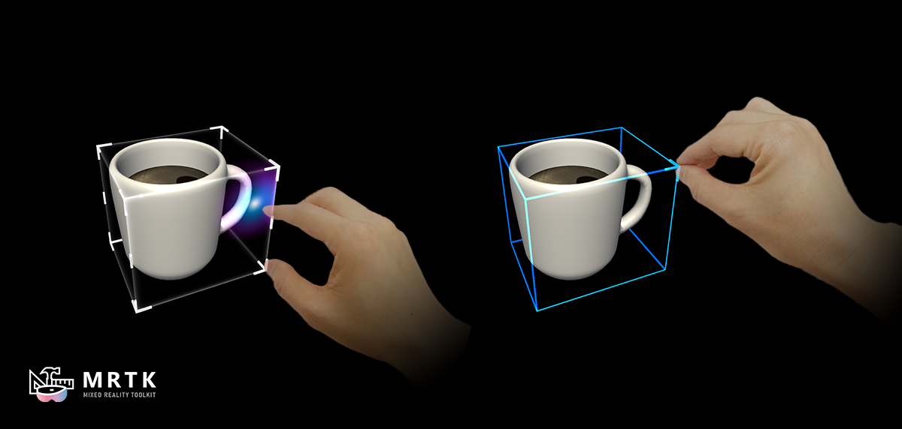

# BoundsControl

Bounds Control is a component that allows the user to change the position, rotation, and size of an actor, using _affordances_. Affordances are grabbable areas on corners (scale), edges (rotate), and faces (translate) of the actor's bounding box.

To enable bounds control on an actor, add an `UUxtBoundsControlComponent` to it. The component has a default configuration that can be tweaked to change the behavior and appearance as needed.

## Bounds Control Config

`UxtBoundsControlConfig` data assets are used to configure:

* `Affordances` array. Each has:
  * `Placement`. Enumerator with the position of the affordance around the actor. For example, `CornerFrontTopLeft`, `EdgeBottomRight` or `FaceBack`. See `EUxtAffordancePlacement` for a complete list.
  * `Rotation` of the instanced mesh.
* `IsSlate`. Whether it should be considered a 2D element or not. If so, it won't scale along the _X_ axis.
* `UniformScaling`. Whether uniform or non-uniform scaling is desired.

There are some presets in _BoundsControl/Presets_:

* `BoundsControlDefault`: All corner and edge affordances with uniform scaling.
* `BoundsControlSlate2D`: Only front corners and edges, with non-uniform scaling.

## Integration with manipulator constraints

The `UUxtBoundsControlComponent` works out of the box with the same constraint components that [Manipulators](./Manipulator.md) use. For example, simply adding and configuring a `UUxtRotationAxisConstraint` component will prevent rotation around the appropriate axes when interacting via affordances.

## Affordance meshes

At runtime a separate actor is created for displaying affordances. Each affordance is a StaticMesh component on the BoundsControlActor. The mesh used for each kind of affordance (Corner, Edge, Face, Center) can be changed on the bounds control component (`Corner Affordance Mesh` etc.).

When creating custom affordance meshes you can fine tune the orientation of each affordance by duplicating one of the preset layouts and modifying the _Rotation_ properties. It is recommended to use simple box collision primitives to make affordances grabbable.
