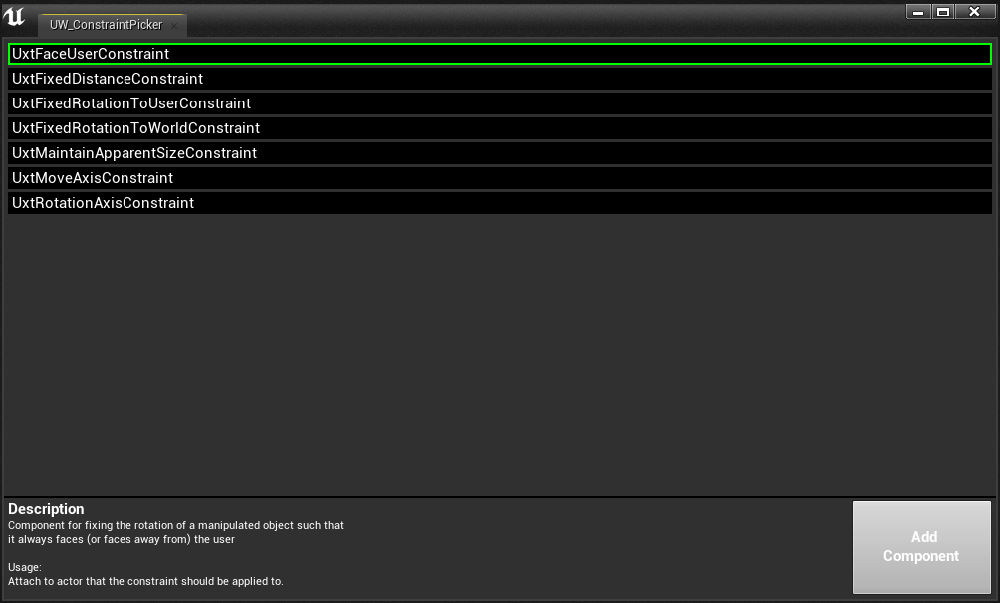
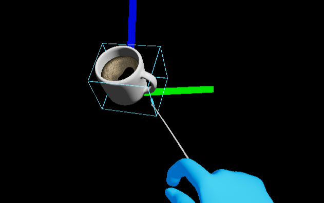
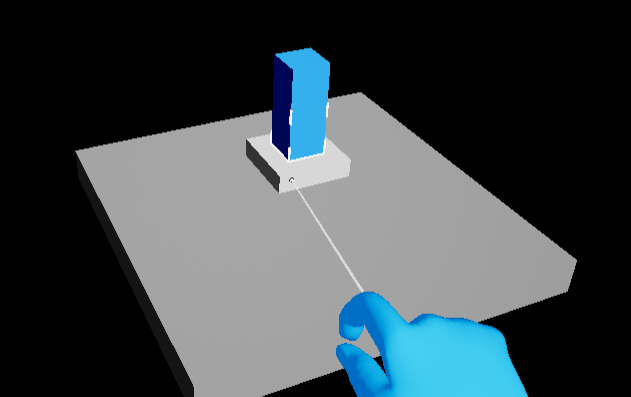
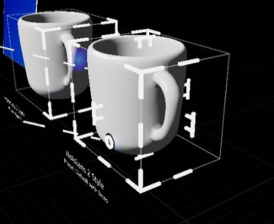

# UX Tools 0.12.0 release notes

- [What's new](#whats-new)
  - [Cross-platform support for XR devices](#cross-platform-support-for-xr-devices)
  - [Manipulator improvements](#manipulator-improvements)
  - [Bounds Control improvements](#bounds-control-improvements)
  - [Tap to Place improvements](#tap-to-place-improvements)
  - [Touchable Volume improvements](#touchable-volume-improvements)
- [Breaking changes](#breaking-changes)
  - [UxtHandTrackingFunctionLibrary removed](#uxthandtrackingfunctionlibrary-removed)
  - [UxtMathUtilsFunctionLibrary's API update](#uxtmathutilsfunctionlibrarys-api-update)
  - [UxtOneHandedRotationMode](#uxtonehandedrotationmode)
  - [UxtTransformConstraint](#uxttransformconstraint)
  - [UxtTouchableVolumeComponent's API update](#uxttouchablevolumecomponents-api-update)
  - [UxtRotationAxisConstraint](#uxtrotationaxisconstraint)
  - [UxtMinMaxScaleConstraint](#uxtminmaxscaleconstraint)
  - [Renamed mesh for Bounds Control's face handles](#renamed-mesh-for-bounds-controls-face-handles)
  - [UxtBasePressableButtonActor button component access](#uxtbasepressablebuttonactor-button-component-access)
  - [IUxtHandTracker](#iuxthandtracker)
  - [ControllerOrientation property removed from UUxtFarPointerComponent](#controllerorientation-property-removed-from-uuxtfarpointercomponent)
  - [Updated smoothing factors for Manipulator and Pinch Slider](#updated-smoothing-factors-for-manipulator-and-pinch-slider)
- [Known issues](#known-issues)
- [Full change list](#full-change-list)

This release of the UX Tools has been tested on HoloLens 2 and Windows Mixed Reality VR but should work on all [XR devices supported by Unreal Engine via OpenXR](https://docs.unrealengine.com/en-US/SharingAndReleasing/XRDevelopment/OpenXR/#platformsupport):
- HoloLens 2
- Windows Mixed Reality VR
- Oculus
- Steam VR

Unreal 4.26 required.

## What's new

These are some of this release's highlights. For a more comprehensive list of changes see the [full change list](#full-change-list).

### Cross-platform support for XR devices

UX Tools now offers cross-platform support across XR devices! UXT 0.12.0 leverages the common AR and VR interfaces added in Unreal Engine 4.26 to keep application code platform agnostic. This means UX Tools is no longer tied to the Windows Mixed Reality plugin and HoloLens 2 device. UXT 0.12.0 supports OpenXR and can be used with the [Microsoft OpenXR](https://github.com/microsoft/Microsoft-OpenXR-Unreal) plugin for full support of HoloLens 2 and Windows Mixed Reality VR headsets. Note that while we have only tested UXT 0.12.0 on Microsoft's mixed reality headsets, we expect UXT to work on all devices that support OpenXR.

### Manipulator improvements

#### UI to add constraints to Generic Manipulator and Bounds Control

The generic manipulator and bounds control components now provide a constraint picker to allow for fine grained control of what constraints are applied by the manipulator. The constraint picker can be used to add constraints to actor instances and blueprints. The UI automatically populates with classes inheriting from [`UxtTransformConstraint`](Manipulator.md#transform-constraints) so user defined constraints can also be added using this dialog box.



#### Rotation Axis Constraint improvements

The `UUxtRotationAxisConstraint` is now based on quaternions instead of Euler angles. By using swing-twist decomposition, we got rid of rotation errors and undesired flips.

Besides that, `ConstraintOnRotation` has been replaced by `AllowedAxis` in order to better convey the meaning of the constraint and prevent unexpected configurations. If only 1 axis was constrained (which is a configuration previously allowed), combinations of rotations around the other two axes might end up in a rotation that you wouldn't expect to be allowed.

Thanks to these changes, `UUxtBoundsControlComponent` is now able to interact appropriately with this constraint. In the following example, you can see how the constraint works when it only allows rotation around the `Z` axis:

| bUseLocalSpaceForConstraint == false | bUseLocalSpaceForConstraint == true |
| --- | --- |
|  |  |
(NOTE: debug axes aligned to world's have been added for reference)

#### Built-in scale constraint

Instead of relying on an external component (which is easier to forget about or misconfigure), potentially leading to undesired effects such as actor mirroring, all classes inheriting from `UUxtManipulatorComponent` (which includes `UUxtBoundsControlComponent` and `UUxtGenericManipulatorComponent`) have now an implicitly applied scale constraint, configurable via editor. See [TransformConstraints.md](TransformConstraints.md) for details.

#### Fixed slowdown when running below 60 FPS

The calculation of smoothed movement for the manipulator and pinch slider components was using an incorrect formula, leading to slower manipulation when the frame rate drops. See the breaking changes section for necessary action: [Updated smoothing factors for Manipulator and Pinch Slider](#updated-smoothing-factors-for-manipulator-and-pinch-slider).

### Bounds Control improvements

#### Bounds override

`UUxtBoundsControlComponent` now has a `BoundsOverride` property, which (if set) will make the bounds control box and affordances display around that `UPrimitiveComponent` instead of around the whole actor. Please note that this setup will still modify the actor's root transform.

| Unset | Set |
| --- | --- |
|  |  |

#### Improved interaction with Tap to Place

Thanks to the new [`BoundsOverride` property in `UUxtBoundsControlComponent`](#bounds-override) and other few changes, this component and `UUxtTapToPlaceComponent` can now work together.



#### Automatic scaling of affordances with distance to camera

In order to match the HoloLens 2 shell's behavior, affordances are now scaled up, based on the distance to the hologram they are surrounding. This makes it easier to interact with them when the actors are big and far away.

#### Improvements to face affordances

- `UUxtBoundsControlComponent::TransformTarget`'s handling of the `EUxtAffordanceAction::Translate` action has been fixed.
- The face mesh (`SM_BoundingBox_FaceHandle.uasset`) now has collisions, so you can interact with them.
- A new `UUxtBoundsControlConfig` data asset (named `BoundsControlDefaultWithFaces.uasset`) has been added, with face affordances configured by default.
- `BoundsControlExamples.umap` has a new coffee cup instance featuring face handles.
- The default mesh used for face handles has been renamed to `SM_BoundingBox_TranslateHandle.uasset`, so it better matches its scale/rotate counterparts. The old placeholder mesh is also replaced by the appropriate mesh:

| Old mesh | New mesh |
| --- | --- |
|  |  |

### Tap to Place improvements

#### Allow keeping the original orientation of the object being placed

Added `MaintainOrientation` mode to `UxtTapToPlaceComponent` to allow preserving the original orientation of the object while it is being repositioned.

#### Customizable surface normal offset

The TapToPlace component now allows you to specify a custom offset between the object being placed and the surface it is being placed on. This can be achieved by setting `bUseDefaultSurfaceNormalOffset` to false and providing a custom offset in `SurfaceNormalOffset` property. The offset is measured from the pivot point of the object along the X axis (towards the positive direction as this is the side which is aligned with the surface).

If `bUseDefaultSurfaceNormalOffset` is set to true, the object will be aligned with the surface on which it is being placed and the value `SurfaceNormalOffset` will be calculated automatically. The offset will now be correct also for objects that use a pivot point which is not located in the centre of the bounding box.

#### Allow Scene Components as target

`UUxtTapToPlaceComponent` allows assigning `USceneComponent` as the `TargetComponent` (previously `UPrimitiveComponent` was required). This allows adding TapToPlace behaviour to any hierarchy of actor components and makes the experience consistent with the other _UX Tools_ components (e.g. `UxtGenericManipulator`).

### Touchable Volume improvements

- An `InteractionMode` property has been added to allow limiting the interactions to only near or far pointers.
- The `bLockFocus` flag has been added to allow the focus locking of pointers be disabled.

## Breaking changes

### UxtHandTrackingFunctionLibrary removed

This function library was just a thin wrapper around the `IUxtHandTracker` interface. It has been removed to make code less redundant. The `IUxtHandTracker` singleton getter returns a reference instead of a pointer for simpler access. If the function library was used in blueprints, the equivalent functions of the XR tracking system should be used, such as [Get Motion Controller Data](https://docs.unrealengine.com/en-US/BlueprintAPI/Input/XRTracking/GetMotionControllerData/index.html).

### UxtMathUtilsFunctionLibrary's API update

`CalculateNestedActorBoundsInGivenSpace` and `CalculateNestedActorBoundsInLocalSpace` have been removed in favor of a simpler and more flexible `CalculateNestedBoundsInGivenSpace`.

Hopefully, switching to the new function is not troublesome, but here are some guidelines:

- The first parameter is now a `USceneComponent` instead of an `AActor`. Simply add a `GetRootComponent()` to the previously used parameter.
- If you were using the `InLocalSpace` variant, now you need to pass in the local space explicitly. On the same component that you're now passing as first parameter (see previous point), simply use `GetComponentTransform().Inverse()`.
- The `Ignore` parameter is now a `TArrayView<const USceneComponent* const>`, instead of a single component. Typically, enclosing the previously used parameter in curly braces `{}` will suffice, thanks to the [TArrayView's initializer list constructor][tarrayview-initializer-list-ctor]. The [MakeArrayView overload list][makearrayview-overload-list] and [MoveTemp][movetemp] utilities might come in handy, too.

### UxtOneHandedRotationMode

- `MaintainOriginalRotation`, `MaintainOriginalRotation`, `MaintainOriginalRotation`, `MaintainOriginalRotation` and `MaintainOriginalRotation` have been removed in favor of using [transform constraints](Manipulator.md#transform-constraints).

### UxtTransformConstraint

- The `TargetComponent` property has been removed in favor of using `WorldPoseOnManipulationStart`.

### UxtTouchableVolumeComponent's API update

- The `OnBeginFocus`, `OnUpdateFocus`, `OnEndFocus` events now pass the pointer as a `UUxtPointerComponent` instead of a `UObject`.
- The `OnBeginPoke`, `OnUpdatePoke`, `OnEndPoke` events now pass the pointer as a `UUxtPointerComponent` instead of a `UUxtNearPointerComponent`.

### UxtRotationAxisConstraint

As mentioned in the [UxtRotationAxisConstraint's improvement](#improved-uxtrotationaxisconstraints-interaction-with-uxtboundscontrol-and-uxtgenericmanipulator) section, `ConstraintOnRotation` has been replaced by `AllowedAxis`, becoming a single `EUxtAxis` instead of a bit mask. Any existing instances of this constraint will take the value `EUxtAxis::None` by default (preventing any rotations at all), so you need to reconfigure said instances by selecting the axis you want to allow rotation around.

In the event that you had any `UUxtRotationAxisConstraint` instanced from C++ code, please remember to check for any assignments of `ConstraintOnRotation`, such as

```C++
RotationConstraint->ConstraintOnRotation = static_cast<uint32>(EUxtAxisFlags::X | EUxtAxisFlags::Y | EUxtAxisFlags::Z);
```

and replace them by the corresponding

```C++
RotationConstraint->AllowedAxis = EUxtAxis::None;
```

### UxtMinMaxScaleConstraint

As this component has been removed and its functionality is now embedded inside `UUxtManipulatorComponent`, you need to revisit any instances of this constraint that you had. All you need to do is copy the `MinScale`, `MaxScale` and `bRelativeToInitialScale` values over to all applicable components in the actor. Please remember that, if you have `UUxtBoundsControlComponent` and `UUxtGenericManipulatorComponent` in the same actor, you now need to configure both of them separately.

### Renamed mesh for Bounds Control's face handles

The asset has been renamed to better match its rotate/scale counterparts, so you need to replace any references to `SM_BoundingBox_FaceHandle.uasset` by `SM_BoundingBox_TranslateHandle.uasset`.

### UxtBasePressableButtonActor button component access

The `UxtBasePressableButtonActor`'s ButtonComponent property has been changed from `BlueprintReadWrite` to `BlueprintReadOnly` because changing the button component is an unsupported code path.

### IUxtHandTracker

The `EUxtHandJoint` enum has been replaced by EHandKeypoint, which is part of the UE4 engine (_HeadMountedDisplayTypes.h_). This affects the "Joint" parameter in the `IUxtHandTracker::GetJointState` function.

### ControllerOrientation property removed from UUxtFarPointerComponent

This property was only caching the wrist orientation. The far pointer is now using the Grip pose for the controller orientation, which can be acquired directly through the IUxtHandTracker interface (see `IUxtHandTracker::GetGripPose`).

### Updated smoothing factors for Manipulator and Pinch Slider

The `Smoothing` factors in the `UUxtGenericManipulatorComponent` and `UUxtPinchSliderComponent` have been replaced by `LerpTime` properties, similar to `UUxtFollowComponent`, `UUxtHandConstraintComponent`, and `UUxtTapToPlaceComponent`. If your manipulator or slider used a non-default smoothing factor you may want to adjust the new `LerpTime` property to achieve matching behavior.

If necessary you can calculate the exact equivalent `LerpTime` at 60 FPS using the formula below:

`LerpTime = -1 / (60 * log(1 - exp(-Smoothing / 60)))`

where log is the natural logarithm.

Here are a few values for comparison:
|`Smoothing`|`LerpTime`|
|---|---|
|0|0|
|0.1|0.0026|
|1|0.0041|
|10|0.0089|
|100|0.080|

## Known issues

## Full change list

| Commit | Description |
| --- | --- |
| [5e5d84b8e](https://github.com/microsoft/MixedReality-UXTools-Unreal/commit/5e5d84b8e) | Update README and release notes for 0.12.x |
| [5c48e6f6b](https://github.com/microsoft/MixedReality-UXTools-Unreal/commit/5c48e6f6b) | Fix handmenu scale warning |
| [d3e820019](https://github.com/microsoft/MixedReality-UXTools-Unreal/commit/d3e820019) | Enable XRSimulation to be built on Hololens and Android |
| [9c5858950](https://github.com/microsoft/MixedReality-UXTools-Unreal/commit/9c5858950) | Workaround for resetting on tracking loss. |
| [0dd33d5fd](https://github.com/microsoft/MixedReality-UXTools-Unreal/commit/0dd33d5fd) | Update to 4.26.2 |
| [9b69367d3](https://github.com/microsoft/MixedReality-UXTools-Unreal/commit/9b69367d3) | Apply workaround for WMR grip pose not applying world scale |
| [b6a01919d](https://github.com/microsoft/MixedReality-UXTools-Unreal/commit/b6a01919d) | Adding option (default) to not instance tick marks on sliders. |
| [964b13b51](https://github.com/microsoft/MixedReality-UXTools-Unreal/commit/964b13b51) | Mention the broken smoothing at low FPS for manipulator and pinch slider as a known issue |
| [b46c04485](https://github.com/microsoft/MixedReality-UXTools-Unreal/commit/b46c04485) | Restrict Bounds Control's grab target component to one-handed |
| [3c8141568](https://github.com/microsoft/MixedReality-UXTools-Unreal/commit/3c8141568) | Fix BoundsControl's release notes |
| [594109019](https://github.com/microsoft/MixedReality-UXTools-Unreal/commit/594109019) | Fix for Tooltip Desc Grammer |
| [7ee136cf8](https://github.com/microsoft/MixedReality-UXTools-Unreal/commit/7ee136cf8) | Feature panel button for toggling AR surface mesh display |
| [8560ddaeb](https://github.com/microsoft/MixedReality-UXTools-Unreal/commit/8560ddaeb) | Ensure LerpAmount in TapToPlace does not exceed 1 |
| [4fa650614](https://github.com/microsoft/MixedReality-UXTools-Unreal/commit/4fa650614) | Minor change to to the hand's fresnel material. |
| [17786d51a](https://github.com/microsoft/MixedReality-UXTools-Unreal/commit/17786d51a) | Fix near interaction in scenes with "Collision for Mesh Data" enabled |
| [b8d47e5ac](https://github.com/microsoft/MixedReality-UXTools-Unreal/commit/b8d47e5ac) | Fix TapToPlace object orientation |
| [dfb8e77a0](https://github.com/microsoft/MixedReality-UXTools-Unreal/commit/dfb8e77a0) | Stabilize the grip pose from input sim to avoid movement when grabbing objects. |
| [b967855a6](https://github.com/microsoft/MixedReality-UXTools-Unreal/commit/b967855a6) | Fix manipulation started notification PR |
| [59fbf430f](https://github.com/microsoft/MixedReality-UXTools-Unreal/commit/59fbf430f) | Add AffordanceConfig assets without the constrained affordances |
| [b77219caf](https://github.com/microsoft/MixedReality-UXTools-Unreal/commit/b77219caf) | Add manipulation started notification |
| [239a98deb](https://github.com/microsoft/MixedReality-UXTools-Unreal/commit/239a98deb) | Adding extra checks to FUXToolsEditorModule::ShutdownModule. |
| [ffb88ce24](https://github.com/microsoft/MixedReality-UXTools-Unreal/commit/ffb88ce24) | Use lower case for anchors in docs. |
| [12b9709d6](https://github.com/microsoft/MixedReality-UXTools-Unreal/commit/12b9709d6) | Move XRSimulation parts out of the UxtDefaultHandTrackerSubsystem. |
| [59318194c](https://github.com/microsoft/MixedReality-UXTools-Unreal/commit/59318194c) | Added 'OnValueUpdated' event to slider actor |
| [8b19a2562](https://github.com/microsoft/MixedReality-UXTools-Unreal/commit/8b19a2562) | Add breaking change note about the use of input sim in the WMR plugin. |
| [1808bb3ef](https://github.com/microsoft/MixedReality-UXTools-Unreal/commit/1808bb3ef) | Button example map had stale menu BP property override, needed BP recompile. |
| [5a7a1f914](https://github.com/microsoft/MixedReality-UXTools-Unreal/commit/5a7a1f914) | Increment plugin versions to 0.12.x |
| [b6955100c](https://github.com/microsoft/MixedReality-UXTools-Unreal/commit/b6955100c) | Replace face handle meshes |
| [336bb8cf1](https://github.com/microsoft/MixedReality-UXTools-Unreal/commit/336bb8cf1) | Fix clang formatting error. |
| [ad0a4a433](https://github.com/microsoft/MixedReality-UXTools-Unreal/commit/ad0a4a433) | Replace WMR hand tracking with new XRTrackingSystem APIs |
| [2b4829a52](https://github.com/microsoft/MixedReality-UXTools-Unreal/commit/2b4829a52) | Adding new banners from Emily. |
| [b32ba809d](https://github.com/microsoft/MixedReality-UXTools-Unreal/commit/b32ba809d) | Changing the AUxtBasePressableButtonActor button component to readonly. |
| [63b22b93f](https://github.com/microsoft/MixedReality-UXTools-Unreal/commit/63b22b93f) | Enable text input in Widgets example scene |
| [74ba46a0e](https://github.com/microsoft/MixedReality-UXTools-Unreal/commit/74ba46a0e) | Make MinMaxScaleConstraint implicit |
| [61b7eca05](https://github.com/microsoft/MixedReality-UXTools-Unreal/commit/61b7eca05) | Text Formatting Docs |
| [1bd66c704](https://github.com/microsoft/MixedReality-UXTools-Unreal/commit/1bd66c704) | Add checks when calling GetOwner to handle cases where a component owner is null |
| [bd6d6cf5c](https://github.com/microsoft/MixedReality-UXTools-Unreal/commit/bd6d6cf5c) | Added videos section to README with link to Inside Unreal talk |
| [36185ada3](https://github.com/microsoft/MixedReality-UXTools-Unreal/commit/36185ada3) | Fix BoundsControl's face affordances |
| [44249b2cd](https://github.com/microsoft/MixedReality-UXTools-Unreal/commit/44249b2cd) | Rewrite RotationAxisConstraint |
| [44524b64c](https://github.com/microsoft/MixedReality-UXTools-Unreal/commit/44524b64c) | RecoverySpeed Units Documentation |
| [3d484a777](https://github.com/microsoft/MixedReality-UXTools-Unreal/commit/3d484a777) | Generate API Reference as markdown |
| [b45137eae](https://github.com/microsoft/MixedReality-UXTools-Unreal/commit/b45137eae) | Fix the map reference for the loader map in packaging settings. |
| [a5f2950cb](https://github.com/microsoft/MixedReality-UXTools-Unreal/commit/a5f2950cb) | Remove location offsets from Slate2D's bounded meshes |
| [8226b7483](https://github.com/microsoft/MixedReality-UXTools-Unreal/commit/8226b7483) | Add push to GitHub at the end of CI pipeline |
| [8d874b2a0](https://github.com/microsoft/MixedReality-UXTools-Unreal/commit/8d874b2a0) | Fix-up example assets to allow UXToolsGame enable Blueprint nativization |
| [bdd0e3721](https://github.com/microsoft/MixedReality-UXTools-Unreal/commit/bdd0e3721) | Increasing the Proximity_Far_Radius from 16 to 40 |
| [b5e418b14](https://github.com/microsoft/MixedReality-UXTools-Unreal/commit/b5e418b14) | Spline jitter fix: adding billboarding pivot to tooltip actor |
| [a90c8d8cc](https://github.com/microsoft/MixedReality-UXTools-Unreal/commit/a90c8d8cc) | Update Unreal Editor version to 4.26.1 |
| [6ce10682e](https://github.com/microsoft/MixedReality-UXTools-Unreal/commit/6ce10682e) | Scale BoundsControl's affordances |
| [4c9ab1fe4](https://github.com/microsoft/MixedReality-UXTools-Unreal/commit/4c9ab1fe4) | Manipulation constraint picker |
| [a826eb1fb](https://github.com/microsoft/MixedReality-UXTools-Unreal/commit/a826eb1fb) | TouchableVolume improvements |
| [050be5bcb](https://github.com/microsoft/MixedReality-UXTools-Unreal/commit/050be5bcb) | Update Release Notes |
| [b10c2af97](https://github.com/microsoft/MixedReality-UXTools-Unreal/commit/b10c2af97) | Add BoundsOverride to BoundsControl |
| [43acdf9b3](https://github.com/microsoft/MixedReality-UXTools-Unreal/commit/43acdf9b3) | Remove the UxtHandTrackingFunctionLibrary |
| [2d730a801](https://github.com/microsoft/MixedReality-UXTools-Unreal/commit/2d730a801) | Add MaintainOrientation mode to TapToPlace component |
| [ce09134f2](https://github.com/microsoft/MixedReality-UXTools-Unreal/commit/ce09134f2) | Change MinMaxScaleConstraint to be relative to initial scale by default |
| [2ea6499ac](https://github.com/microsoft/MixedReality-UXTools-Unreal/commit/2ea6499ac) | Pipeline for generating shipping builds of UXToolsGame |
| [35e4d68e9](https://github.com/microsoft/MixedReality-UXTools-Unreal/commit/35e4d68e9) | Add Button and Follow component automation test |
| [471fe1bc5](https://github.com/microsoft/MixedReality-UXTools-Unreal/commit/471fe1bc5) | Ensuring packaged builds are in the shipping config. |
| [bb6008e3c](https://github.com/microsoft/MixedReality-UXTools-Unreal/commit/bb6008e3c) | Reposition BP for example levels |


[tarrayview-initializer-list-ctor]: https://docs.unrealengine.com/en-US/API/Runtime/Core/Containers/TArrayView/__ctor/3/index.html
[makearrayview-overload-list]: https://docs.unrealengine.com/en-US/API/Runtime/Core/Containers/MakeArrayView/index.html
[movetemp]: https://docs.unrealengine.com/en-US/API/Runtime/Core/Templates/MoveTemp/index.html
