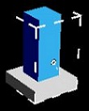
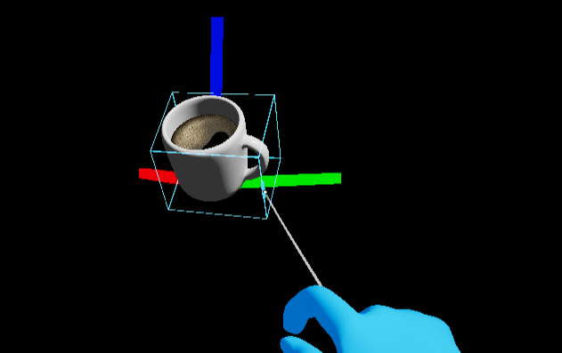
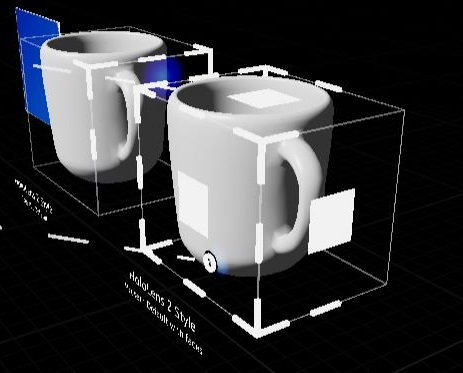

# UX Tools 0.12.0 release notes

- [What's new](#whats-new)
  - [TapToPlace component MaintainOrientation setting](#taptoplace-component-maintainorientation-setting)
  - [TapToPlace component orientation fixes](#taptoplace-component-orientation-fixes)
  - [BoundsOverride property in UxtBoundsControl](#boundsoverride-property-in-uxtboundscontrol)
  - [UxtBoundsControl and UxtTapToPlace integration](#uxtboundscontrol-and-uxttaptoplace-integration)
  - [Constraint Picker](#constraint-picker)
  - [UxtTouchableVolumeComponent improvements](#uxttouchablevolumecomponent-improvements)
  - [UxtBoundsControlComponent's affordance scale](#uxtboundscontrolcomponents-affordance-scale)
  - [Improved UxtRotationAxisConstraint's interaction with UxtBoundsControl and UxtGenericManipulator](#improved-uxtrotationaxisconstraints-interaction-with-uxtboundscontrol-and-uxtgenericmanipulator)
  - [UxtBoundsControlComponent's face affordances](#uxtboundscontrolcomponents-face-affordances)
  - [UxtMinMaxScaleConstraint is now implicit](#uxtminmaxscaleconstraint-is-now-implicit)
  - [Added UxtManipulatorComponent](#added-uxtmanipulatorcomponent)
  - [Added new Bounds Control presets without constrained affordances](#added-new-bounds-control-presets-without-constrained-affordances)
- [Breaking changes](#breaking-changes)
  - [UxtHandTrackingFunctionLibrary removed](#uxthandtrackingfunctionlibrary-removed)
  - [UxtMathUtilsFunctionLibrary's API update](#uxtmathutilsfunctionlibrarys-api-update)
  - [UxtOneHandedRotationMode](#uxtonehandedrotationmode)
  - [UxtTransformConstraint](#uxttransformconstraint)
  - [UxtTouchableVolumeComponent's API update](#uxttouchablevolumecomponents-api-update)
  - [UxtRotationAxisConstraint](#uxtrotationaxisconstraint)
  - [UxtMinMaxScaleConstraint](#uxtminmaxscaleconstraint)
  - [Renamed mesh for Bounds Control's face handles](#renamed-mesh-for-bounds-controls-face-handles)
  - [UxtBasePressableButtonActor button component access](#uxtbasepressablebuttonactor-button-component-access)
  - [WindowsMixedReality input simulation discontinued](#windowsmixedreality-input-simulation-discontinued)
  - [IUxtHandTracker](#iuxthandtracker)
  - [ControllerOrientation property removed from UUxtFarPointerComponent](#controllerorientation-property-removed-from-uuxtfarpointercomponent)
  - [Replaced OnSliderUpdateValue function in pinch actor](#replaced-onsliderupdatevalue-function-in-pinch-actor)
- [Known issues](#known-issues)
- [Full change list](#full-change-list)

This release of the UX Tools supports only HoloLens 2. Support for other MR platforms remains a goal for us and we are hoping to be able to deliver it in the near future.

Unreal 4.26 required.

## What's new

These are some of this release's highlights. For a more comprehensive list of changes see the [full change list](#full-change-list).

### TapToPlace component MaintainOrientation setting

Added `MaintainOrientation` mode to `UxtTapToPlaceComponent`. It allows to preserve the original rotation of the object while it is being repositioned.

### TapToPlace component orientation fixes

Objects using _Align To Surface_ mode used to rotate randomly when placed on horizontal surfaces (e.g. on the floor or on the ceiling). Such objects will now correctly face towards or away from the camera when moved over a horizontal surface. A new `HorizontalSurfaceThreshold` setting (in _Advanced_ properties section) allows to specify the angle at which the object being placed stops rotating with the camera and aligns its Up vector with the surface. Increasing this threshold helps to eliminate jitter resulting from inaccuracies in the reconstructed depth mesh. However, if the value is too high, it can cause the object to lean sideways when moved over slightly inclined surfaces. Therefore, the value should be kept as low as possible. The `HorizontalSurfaceThreshold` is expressed as the angle in degrees that a surface can deviate from horizontal plane and by default is set to 10 degrees.

### BoundsOverride property in UxtBoundsControl

`UxtBoundsControlComponent` now has a `BoundsOverride` property. If set, bounds control box and affordances will surround all of the appropriate primitives in the hierarchy starting at that `USceneComponent`, instead of surrounding the whole actor. Please note that this setup will still modify the actor's root transform.

| Unset | Set |
| --- | --- |
|  |  |

### UxtBoundsControl and UxtTapToPlace integration

Thanks to the new [`BoundsOverride` property in `UUxtBoundsControlComponent`](#boundsoverride-property-in-uxtboundscontrol) and other few changes, this component and `UUxtTapToPlaceComponent` can now work together.


### Constraint Picker

The generic manipulator and bounds control components now provide a constraint picker to allow for fine grained control of what constraints are applied by the manipulator. The constraint picker can be used to add constraints to actor instances and blueprints. The UI automatically populates with classes inheriting from [`UxtTransformConstraint`](Manipulator.md#transform-constraints) so user defined constraints can also be added using this dialog box.


### UxtTouchableVolumeComponent improvements

- An `InteractionMode` property has been added to allow limiting the interactions to only near or far pointers.
- The `bLockFocus` flag has been added to allow the focus locking of pointers be disabled.

### UxtBoundsControlComponent's affordance scale

In order to match the HoloLens 2 shell's behavior, affordances are now scaled up, based on the distance to the hologram they are surrounding. This makes it easier to interact with them when the actors are big and far away.

### Improved UxtRotationAxisConstraint's interaction with UxtBoundsControl and UxtGenericManipulator

The `UUxtRotationAxisConstraint` is now based on quaternions instead of Euler angles. By using swing-twist decomposition, we got rid of rotation errors and undesired flips.

Besides that, `ConstraintOnRotation` has been replaced by `AllowedAxis` in order to better convey the meaning of the constraint and prevent unexpected configurations. If only 1 axis was constrained (which is a configuration previously allowed), combinations of rotations around the other two axes might end up in a rotation that you wouldn't expect to be allowed.

Thanks to these changes, `UUxtBoundsControlComponent` is now able to interact appropriately with this constraint. In the following example, you can see how the constraint works when it only allows rotation around the `Z` axis:

| bUseLocalSpaceForConstraint == false | bUseLocalSpaceForConstraint == true |
| --- | --- |
|  |  |
(NOTE: debug axes aligned to world's have been added for reference)

### UxtBoundsControlComponent's face affordances

- `UUxtBoundsControlComponent::TransformTarget`'s handling of the `EUxtAffordanceAction::Translate` action has been fixed.
- The face mesh (`SM_BoundingBox_FaceHandle.uasset`) now has collisions, so you can interact with them.
- A new `UUxtBoundsControlConfig` data asset (named `BoundsControlDefaultWithFaces.uasset`) has been added, with face affordances configured by default.
- `BoundsControlExamples.umap` has a new coffee cup instance featuring face handles.
- The default mesh used for face handles has been renamed to `SM_BoundingBox_TranslateHandle.uasset`, so it better matches its scale/rotate counterparts. The old placeholder mesh is also replaced by the appropriate mesh:

| Old mesh | New mesh |
| --- | --- |
|  |  |

### UxtMinMaxScaleConstraint is now implicit

Instead of relying on an external component (which is easier to forget about or misconfigure), potentially leading to undesired effects such as actor mirroring, all classes inheriting from `UxtManipulatorComponent` (which includes `UxtBoundsControlComponent` and `UxtGenericManipulatorComponent`) have now an implicitly applied scale constraint, configurable via editor. See [TransformConstraints.md](TransformConstraints.md) for details.

### Added `UxtManipulatorComponent`

This is the new base class for manipulators. It contains common [constraints' logic](TransformConstraints.md) and ensures that manipulators can notify each other when they start a new manipulation by using `OnExternalManipulationStarted` and `NotifyManipulationStarted`, effectively preventing undesired effects such as jitter when two or more of them are updating the transform at the same time.

**NOTE**: It shouldn't be confused with `UxtManipulatorComponentBase`, which will be removed (hopefully in the _0.13.0_ release).

### Added new Bounds Control presets without constrained affordances

The newly added `BoundsControlConstrained.uasset` and `BoundsControlConstrainedWithFaces.uasset` do not include the affordances that are constrained by default in the `BoundsControlExample.umap`, preventing confusion about why they don't rotate.

## Breaking changes

### `UxtHandTrackingFunctionLibrary` removed

This function library was just a thin wrapper around the `IUxtHandTracker` interface. It has been removed to make code less redundant. The `IUxtHandTracker` singleton getter returns a reference instead of a pointer for simpler access. If the function library was used in blueprints, the equivalent functions of the XR tracking system should be used, such as [Get Motion Controller Data](https://docs.unrealengine.com/en-US/BlueprintAPI/Input/XRTracking/GetMotionControllerData/index.html).

### UxtMathUtilsFunctionLibrary's API update

`CalculateNestedActorBoundsInGivenSpace` and `CalculateNestedActorBoundsInLocalSpace` have been removed in favor of a simpler and more flexible `CalculateNestedBoundsInGivenSpace`.

Hopefully, switching to the new function is not troublesome, but here are some guidelines:

- The first parameter is now a `USceneComponent` instead of an `AActor`. Simply add a `GetRootComponent()` to the previously used parameter.
- If you were using the `InLocalSpace` variant, now you need to pass in the local space explicitly. On the same component that you're now passing as first parameter (see previous point), simply use `GetComponentTransform().Inverse()`.
- The `Ignore` parameter is now a `TArrayView<const UPrimitiveComponent* const>`, instead of a single component. Typically, enclosing the previously used parameter in curly braces `{}` will suffice, thanks to the [TArrayView's initializer list constructor][tarrayview-initializer-list-ctor]. The [MakeArrayView overload list][makearrayview-overload-list] and [MoveTemp][movetemp] utilities might come in handy, too.

### UxtOneHandedRotationMode

- `MaintainOriginalRotation`, `MaintainOriginalRotation`, `MaintainOriginalRotation`, `MaintainOriginalRotation` and `MaintainOriginalRotation` have been removed in favor of using [transform constraints](Manipulator.md#transform-constraints).

### UxtTransformConstraint

- The `TargetComponent` property has been removed in favor of using `WorldPoseOnManipulationStart`.

### UxtTouchableVolumeComponent's API update

- The `OnBeginFocus`, `OnUpdateFocus`, `OnEndFocus` events now pass the pointer as a `UUxtPointerComponent` instead of a `UObject`.
- The `OnBeginPoke`, `OnUpdatePoke`, `OnEndPoke` events now pass the pointer as a `UUxtPointerComponent` instead of a `UUxtNearPointerComponent`.

### UxtRotationAxisConstraint

As mentioned in the [UxtRotationAxisConstraint's improvement](#improved-uxtrotationaxisconstraints-interaction-with-uxtboundscontrol-and-uxtgenericmanipulator) section, `ConstraintOnRotation` has been replaced by `AllowedAxis`, becoming a single `EUxtAxis` instead of a bit mask. Any existing instances of this constraint will take the value `EUxtAxis::None` by default (preventing any rotations at all), so you need to reconfigure said instances by selecting the axis you want to allow rotation around.

In the event that you had any `UUxtRotationAxisConstraint` instanced from C++ code, please remember to check for any assignments of `ConstraintOnRotation`, such as

```C++
RotationConstraint->ConstraintOnRotation = static_cast<uint32>(EUxtAxisFlags::X | EUxtAxisFlags::Y | EUxtAxisFlags::Z);
```

and replace them by the corresponding

```C++
RotationConstraint->AllowedAxis = EUxtAxis::None;
```

### UxtMinMaxScaleConstraint

As this component has been removed and its functionality is now embedded inside `UxtManipulatorComponent`, you need to revisit any instances of this constraint that you had. All you need to do is copy the `MinScale`, `MaxScale` and `bRelativeToInitialScale` values over to all applicable components in the actor. Please remember that, if you have `UxtBoundsControlComponent` and `UxtGenericManipulatorComponent` in the same actor, you now need to configure both of them separately.

### Renamed mesh for Bounds Control's face handles

The asset has been renamed to better match its rotate/scale counterparts, so you need to replace any references to `SM_BoundingBox_FaceHandle.uasset` by `SM_BoundingBox_TranslateHandle.uasset`.

### UxtBasePressableButtonActor button component access

The `UxtBasePressableButtonActor`'s ButtonComponent property has been changed from `BlueprintReadWrite` to `BlueprintReadOnly` because changing the button component is an unsupported code path.

### WindowsMixedReality input simulation discontinued

Input simulation lives entirely in the UXTools plugin now.

* The _Platforms > Windows Mixed Reality > Enable Input Simulation_ option is no longer used.
  It is replaced by _Plugins > XR Simulation > Enable Simulation_.
* Accessing WindowsMixedReality API functions will no longer return simulated data.
  The `IUxtHandTracker` API should be used instead.

The WindowsMixedReality plugin code paths for input simulation remain available for backward compatibility with older UXTools versions (<= 0.11.x).

### IUxtHandTracker

The `EUxtHandJoint` enum has been replaced by EHandKeypoint, which is part of the UE4 engine (_HeadMountedDisplayTypes.h_). This affects the "Joint" parameter in the `IUxtHandTracker::GetJointState` function.

### ControllerOrientation property removed from UUxtFarPointerComponent

This property was only caching the wrist orientation. The far pointer is now using the Grip pose for the controller orientation, which can be acquired directly through the IUxtHandTracker interface (see `IUxtHandTracker::GetGripPose`).

### Replaced OnSliderUpdateValue function in pinch actor

If you previously derived from `AUxtPinchSliderActor` and implemented `OnSliderUpdateValue` to listen for value updates you will need to bind to the `OnValueUpdated` event instead.

## Known issues

## Full change list

[tarrayview-initializer-list-ctor]: https://docs.unrealengine.com/en-US/API/Runtime/Core/Containers/TArrayView/__ctor/3/index.html
[makearrayview-overload-list]: https://docs.unrealengine.com/en-US/API/Runtime/Core/Containers/MakeArrayView/index.html
[movetemp]: https://docs.unrealengine.com/en-US/API/Runtime/Core/Templates/MoveTemp/index.html
