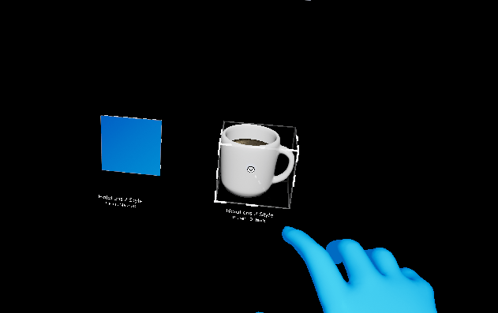
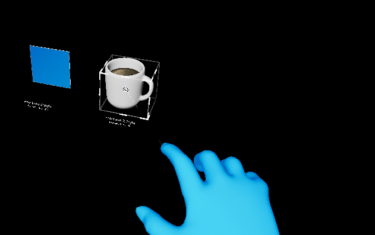
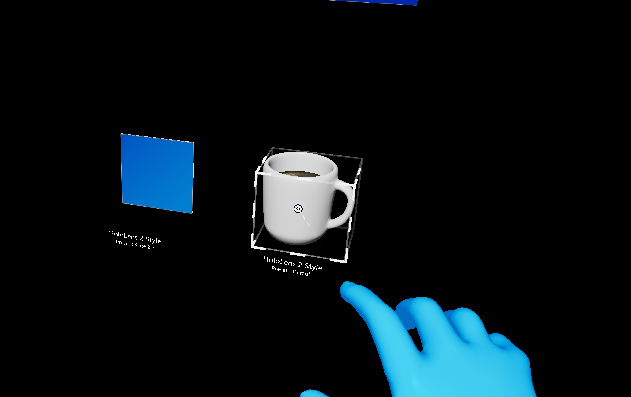
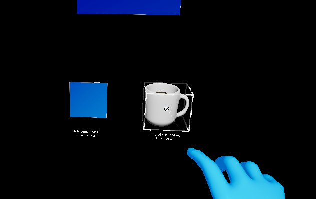
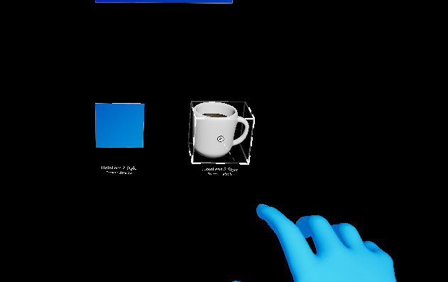
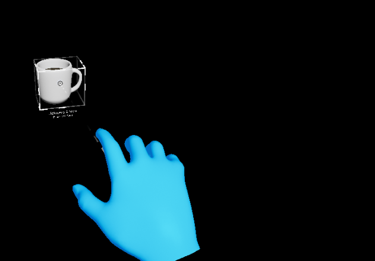
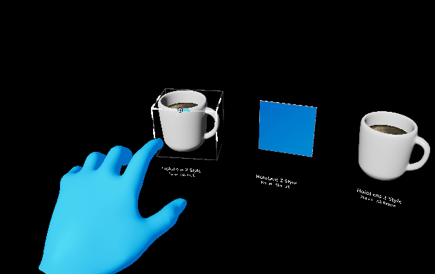

# Transform Constraints

UXTools provides a mechanism to implement and apply transform constraints to actors during manipulation. All you need to do is inherit from `UUxtConstrainableComponent`, as `UUxtGenericManipulatorComponent` and `UUxtBoundsControlComponent` for example.

## Usage

In order to use constraints:

1. Add any desired `UxtTransformConstraint`-derived components to the actor.
2. Add any `UUxtConstrainableComponent`-derived components to the actor, such as `UUxtGenericManipulatorComponent` and `UUxtBoundsControlComponent`.

Each `UUxtConstrainableComponent` will apply all constraint components in the actor if `bAutoDetectConstraints` is set to `true`. Otherwise, you can fill the `SelectedConstraints` array to choose which constraints you'd like that component to apply during its interaction.

## Implicit scale

There's an implicit constraint which doesn't inherit from `UxtTransformConstraint` and is applied by all `UUxtConstrainableComponent`s. The reason for that is preventing their scales from reaching `0` or even negative values. Besides that, `UUxtBoundsControlComponent` avoids having interaction issues with its handles when the scale is too small.

The `MinScale` and `MaxScale` properties give you flexibility to configure this behavior within reasonable values, clamped to prevent the unexpected results previously mentioned.

Use `bRelativeToInitialScale` to configure whether the limits are relative to the scale at interaction start (`true`) or absolute (`false`).

In the following example, `MinScale` is set to `0.3`:

## Built-in constraint components

There are a few built-in constraint components, which will hopefully save you from having to write your own.

### UxtFaceUserConstraint

Makes the actor face the camera while interacting with it.

Set `bFaceAway` to `true` to make the object face away from the camera.

### UxtFixedDistanceConstraint

Makes the actor stay at a fixed distance from the camera.

| With | Without |
| --- | --- |
|  |  |

### UxtFixedRotationToUserConstraint

Makes the actor maintain the same rotation (relative to the user) that it had when the interaction started.

Set `bExcludeRoll` to `false` to allow rolling of the actor.

### UxtFixedRotationToWorldConstraint

Makes the actor maintain the same rotation (relative to the world) that it had when the interaction started.

### UxtMaintainApparentSizeConstraint

Makes the actor maintain the apparent size (relative to the user) that it had when the interaction started.

### UxtMoveAxisConstraint

Limits movement on specific axes. Use the `ConstraintOnMovement` bit mask of `EUxtAxisFlags`.

(Example limiting the movement along the `X` and `Z` axes)

### UxtRotationAxisConstraint

Limits rotation on specific axes. Use the `ConstraintOnRotation` bit mask of `EUxtAxisFlags`.

(Example limiting the rotation around the `X` and `Y` axes)

## Adding more constraint components

If none of the [Built-in constraint components](#built-in-constraint-components) suits your needs, you can add more by simply creating a new `UCLASS` that inherits from `UxtTransformConstraint`. Then, provide implementations for `GetConstraintType`, `ApplyConstraint` and (optionally) `Initialize`.

In this case, please feel free to take a look at our [contributing docs](CONTRIBUTING.md) and make a suggestion!
