# What are the UX Tools?

UX Tools for Unreal Engine is a UE game plugin with code, blueprints and example assets created to help you add in features commonly needed when you're developing UX for Mixed Reality applications.

| NOTE: All OpenXR devices should be supported, although only HoloLens 2 and Windows Mixed Reality VR devices have been tested. |
| --- |

# Getting started with UX Tools

If you're new to MRTK or Mixed Reality development in Unreal, **we recommend starting at the beginning of our** [Unreal development journey](https://docs.microsoft.com/windows/mixed-reality/unreal-development-overview) in the Microsoft Docs. The Unreal development journey is specifically tailored to walk new developers through the installation, core concepts, and usage of the UX Tools.

| CAUTION: The Unreal development journey currently uses **UX Tools 0.12.x** and **Unreal 4.26.0+**. |
| --- |

If you're already familiar with Mixed Reality development in Unreal, you can find the installation instructions for the UX Tools plugin [here](Docs/Installation.md).

# Documentation

|  [Release Notes](Docs/ReleaseNotes.md) |  [Welcome to UX Tools](Docs/WelcomeToUXTools.md)|  [Feature Guides](Docs/InputSimulation.md)|  [API Reference](https://microsoft.github.io/MixedReality-UXTools-Unreal/api/_a_uxt_hand_interaction_actor.html)|
|:---|:---|:--- |:---

# Required software

 |    [Windows SDK 18362+](https://developer.microsoft.com/windows/downloads/windows-10-sdk)|    [Unreal 4.26.0+](https://www.unrealengine.com/get-now)|    [Visual Studio 2019](http://dev.windows.com/downloads)|
| :--- | :--- | :--- |
| To build apps with MRTK-Unreal and UX Tools, you need the Windows 10 May 2019 Update SDK | The Unreal Engine provides support for building Mixed Reality projects in Windows 10 | Visual Studio is used for code editing |

# UX building blocks

|  [Input Simulation](Docs/InputSimulation.md) | [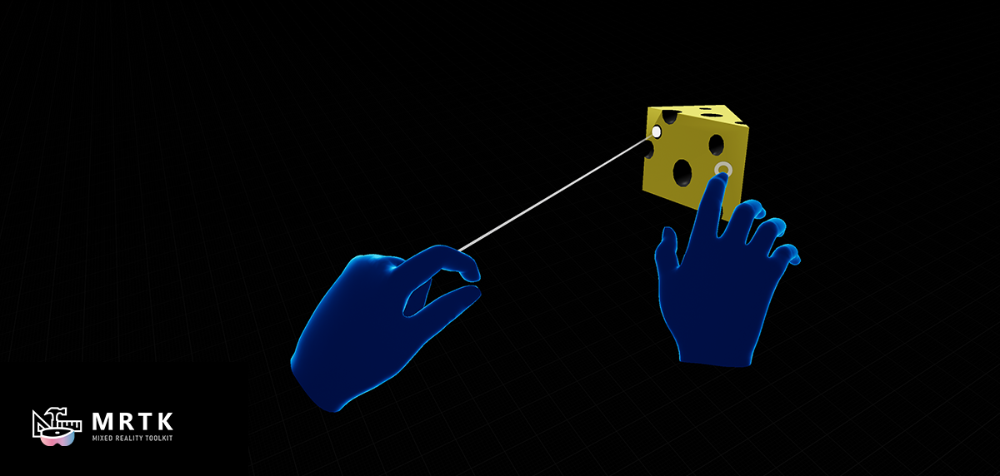](Docs/HandInteraction.md) [Hand Interaction](Docs/HandInteraction.md) |  [Button](Docs/PressableButton.md) |
|:--- | :--- | :--- |
| In-editor simulation of articulated hands and headset pose | Support for far and near hand interactions with Unreal's primitives | A 3d button specifically designed for hand interactions |
| [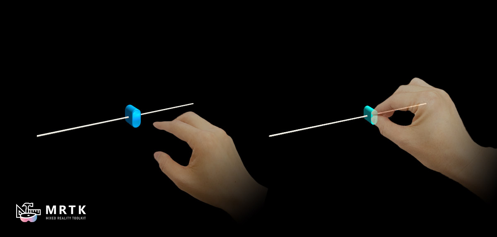](Docs/PinchSlider.md) [Slider](Docs/PinchSlider.md)|  [Bounds Control](Docs/BoundsControl.md)| [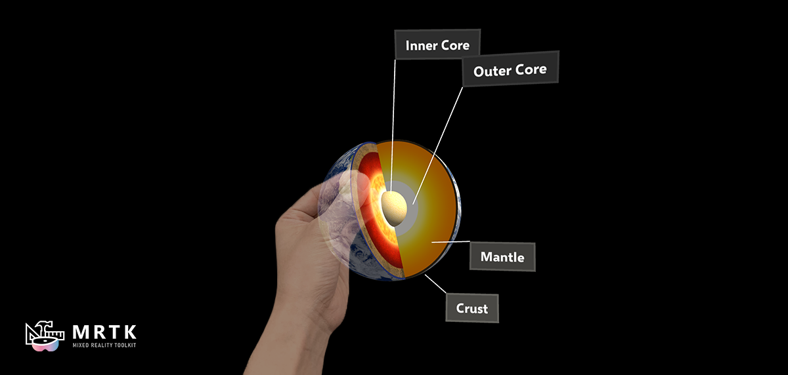](Docs/Manipulator.md) [Manipulators](Docs/Manipulator.md)|
| A 3d slider specifically designed for hand interactions | A component that allows the user to transform an actor via affordances | A component that allows an actor to be picked up by a user and then moved, rotated or scaled |
| [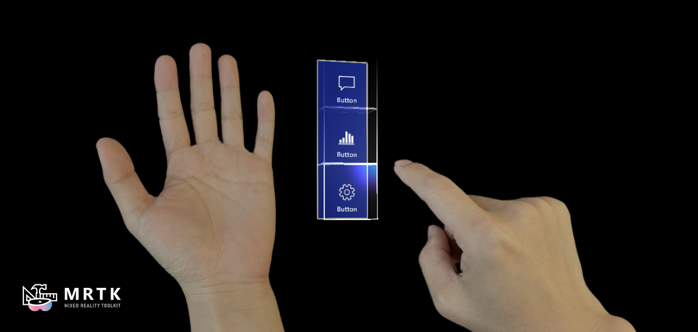](Docs/HandMenu.md) [Hand Menu](Docs/HandMenu.md) |  [Near Menu](Docs/NearMenu.md) |  [Scrolling Object Collection](Docs/ScrollingObjectCollection.md) |
| Hand-attached UI great for frequently used functions | Floating menu UI for near interactions | Enables scrolling of 3D lists or grids of content through a contained viewable area |
| [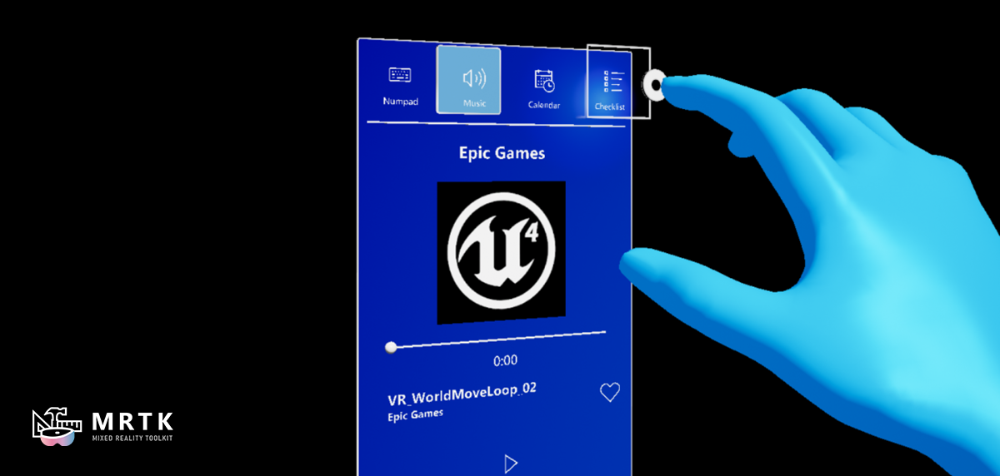](Docs/UIElements.md) [UI Element](Docs/UIElements.md) | [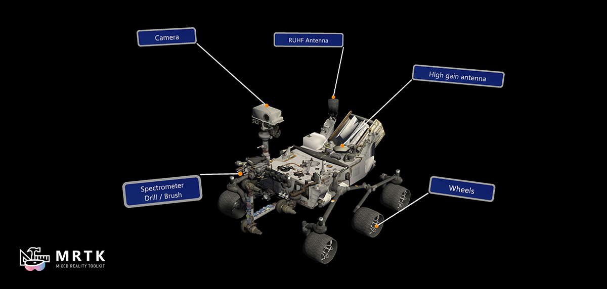](Docs/Tooltip.md) [Tooltips](Docs/Tooltip.md) | [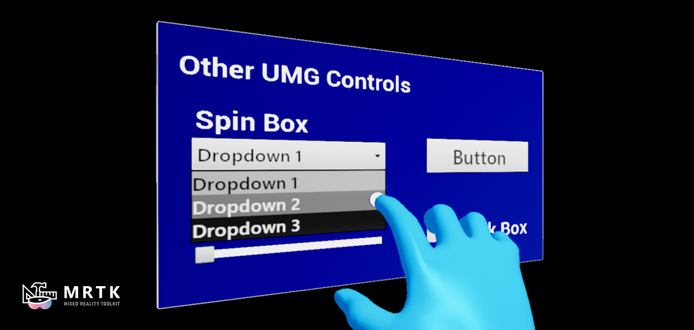](Docs/WidgetComponent.md) [UMG support](Docs/WidgetComponent.md) |
| A component that allows an actor's visibility to be controlled by its parent actor, allowing for easy construction of hierarchical UIs | Annotation UI with a flexible anchor/pivot system, which can be used for labeling objects | A component that allows hand-driven interactions with Unreal's UMG widgets |
| [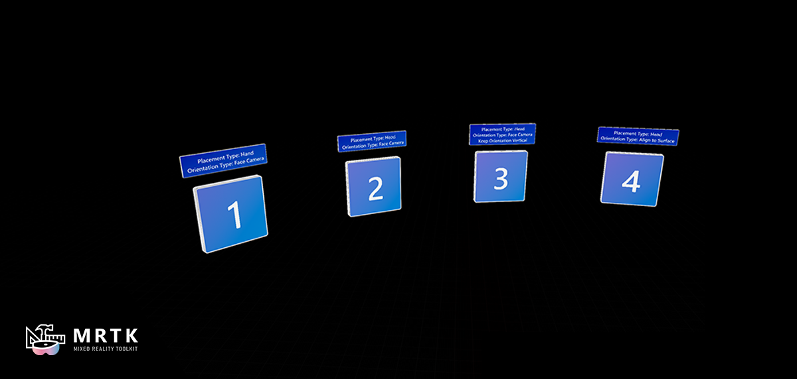](Docs/TapToPlaceComponent.md) [Tap to Place](Docs/TapToPlaceComponent.md) | [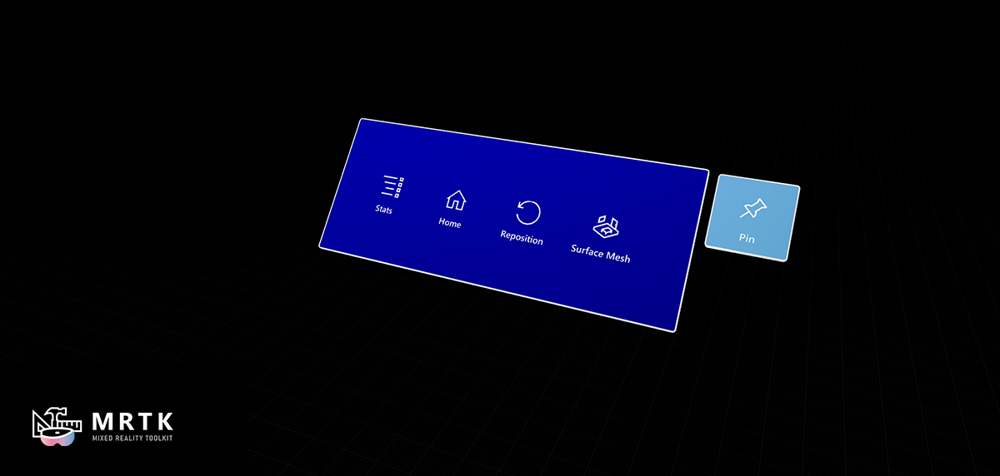](Docs/FollowComponent.md) [Follow Behavior](Docs/FollowComponent.md) | [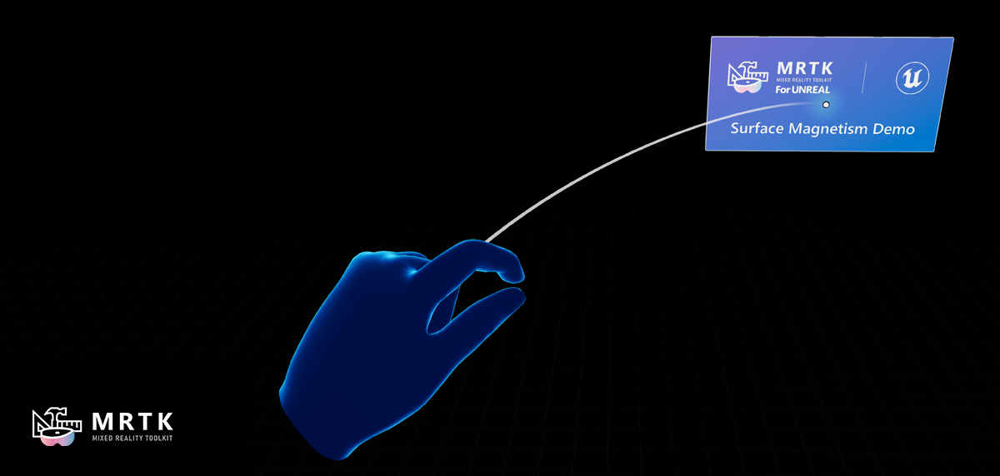](Docs/SurfaceMagnetism.md) [Surface Magnetism](Docs/SurfaceMagnetism.md) |
| A component that can be used to easily place primitive components against surfaces | A component used to keep objects "following" the user by applying a set of constraints on the component's owner | A component that allows an actor to stick to a surface |
|  [Touchable Volume](Docs/TouchableVolume.md) | | |
| A component that allows the user to interact with an object by touching it | |

# Tools

|   [Utilities](Docs/Utilities.md) |  [Graphics](Docs/Graphics.md) | 
|:--- | :--- | 
| Plugin containing a handful of tools that augment the Unreal Engine editor | Breakdown of shaders, materials, and graphics techniques used to render UX components | 

# Example maps

If you want to explore the different UXT features you can try out the _UX Tools Game_ project. You can download the [pre-built UX Tools Game application](#packaged-ux-tools-game-example-application) and deploy it to a HoloLens device right away. Alternatively, you can [build the latest version of UX Tools Game](#building-the-latest-ux-tools-game-example-application) from source.

It is also possible to [try out the UX Tools examples inside your own project](#importing-examples-to-your-project). Please note that the examples should be only used as a reference. Your final project should not have a dependency on the _UX Tools Examples_ plugin.

## Packaged UX Tools Game example application

We also provide the _UX Tools Game_ pre-packaged for HoloLens 2, so you can try out the main _UX Tools_ features directly on device easily. To use it:

1. Obtain the packaged game from the latest release page (i.e. `UXTGame-HoloLens.<version>.zip`) and unzip it to a local directory.
1. Install it in the device via the [Device Portal](https://docs.microsoft.com/en-us/windows/uwp/debug-test-perf/device-portal#install-sideload-an-app).

## Building the latest UX Tools Game example application

For that you should:

1. [Clone](https://help.github.com/en/desktop/contributing-to-projects/cloning-a-repository-from-github-to-github-desktop) this repository.
1. [Checkout](https://help.github.com/en/desktop/contributing-to-projects/switching-between-branches) the latest 'public/_version_.x' branch.
    * Bear in mind that this branch is alive. It's not a release, and will be **updated regularly with potentially breaking changes**. There will be a release tag (e.g. _release/0.11.0_) marked as such in GitHub.

You can now open the _UX Tools Game_ (`/UXToolsGame/UXToolsGame.uproject`) and explore individual example maps or open the _Loader_ level to access some of the examples from a centralized hub. 

## Importing examples to your project

You can also copy the _UX Tools Examples_ to a new project. This is a convenient way to use the provided sample scenes as a reference when building your own Mixed Reality experiences. You are free to reuse the sample UI elements but please ensure that your final project does not declare a dependency on the _UX Tools Examples_ plugin.

There are two ways in which you can add the example scenes to your project:

* You can obtain a pre-built version of the _UX Tools Examples_ plugin from the latest GitHub release. You can download `UXToolsExamples.<version>.zip` from release attachments and extract its contents into the `Plugins` folder inside your Unreal Engine project.
* Alternatively, you can [clone](https://help.github.com/en/desktop/contributing-to-projects/cloning-a-repository-from-github-to-github-desktop) this repository and copy `UXToolsGame/Plugins/UXToolsExamples` to the `Plugins` subdirectory in your own project.

If you want to use content from the examples plugin as part of your project, make sure to copy that content to your project's `Content` folder. Newer versions of the examples plugin may change or remove existing content without notice.

Please note that you also need to [add the UX Tools plugin to your project](Docs/Installation.md). Always use a _UX Tools Plugin_ version that matches the version of the _UX Tools Examples_. Example content is only guaranteed to work with a single version of the _UX Tools Plugin_ as releases can introduce breaking changes.

# Sample apps made with UX Tools

|  |  |
|:--- |:--- |
| This simple [Chess App](https://github.com/microsoft/MixedReality-Unreal-Samples/tree/master/ChessApp) is the final result of following the getting started tutorial located on Microsoft's Mixed Reality docs. If you're new to Mixed Reality development and UX Tools, get started here: [Build a chess app with MRTK UX Tools](https://docs.microsoft.com/en-us/windows/mixed-reality/develop/unreal/tutorials/unreal-uxt-ch1) | [Kippy's Escape](https://github.com/microsoft/MixedReality-Unreal-KippysEscape) is an open-source HoloLens 2 sample app demonstrating how to use UX Tools components to create a fun and interactive Mixed Reality experience. Read the story behind the app: [The Making of Kippy's Escape](https://aka.ms/KippysEscape) |

# Videos

| [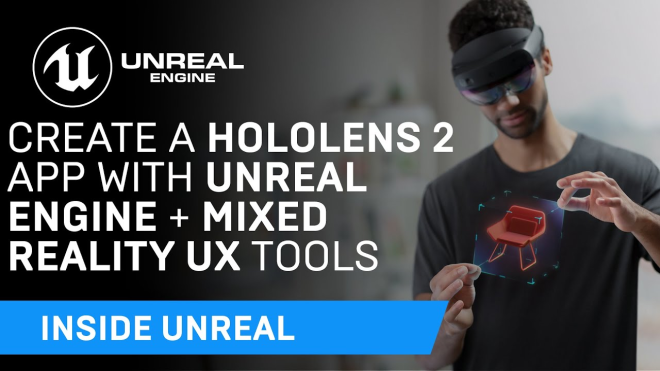](https://youtu.be/u_qR-1DrvMg) | [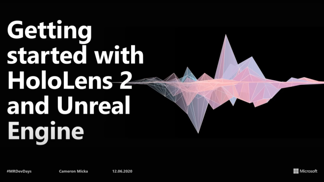](https://youtu.be/tGYGA_L8Pnw) | [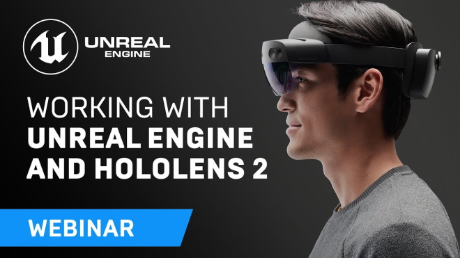](https://youtu.be/t95Bge-yk5E) |
| :--- | :--- | :--- |
| A step-by-step tutorial on how to set up a dev environment for HoloLens 2 and a simple level from scratch | Walk through how to get started developing for HoloLens 2 using Unreal Engine | Webinar showing how to build a product configurator using UX Tools |

# Feedback and contributions

Contributions and feedback in the shape of bug reports, suggestions and feature requests are always welcome! However, we are not in a position to accept external contributions through pull requests at this time.
